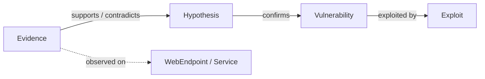
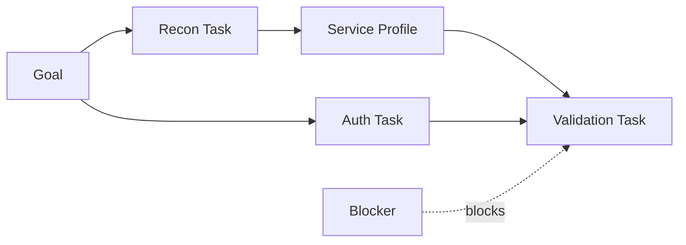
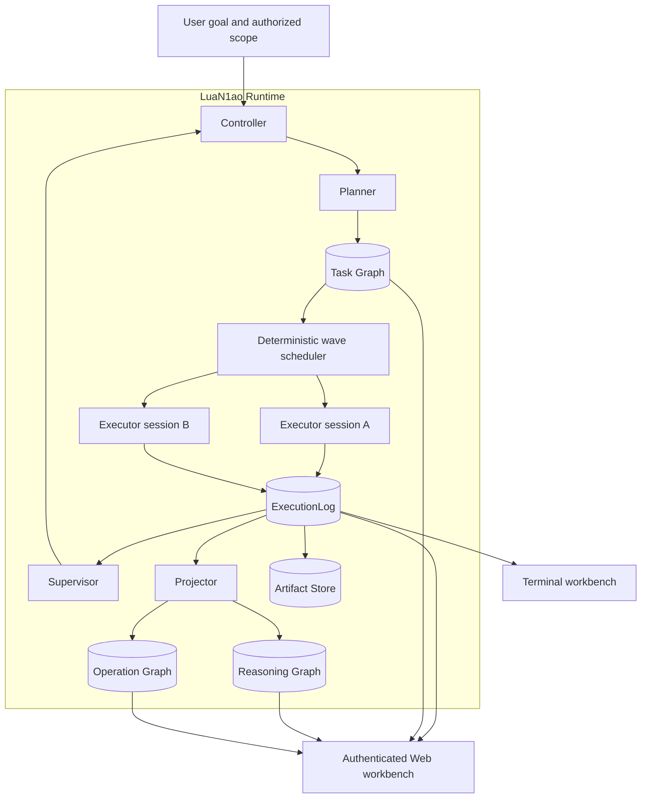

<h1 align="center">LuaN1aoAgent</h1>

<h2 align="center">

**Cognitive-Driven Autonomous Security Agent**

</h2>

<div align="center">

[](https://www.apache.org/licenses/LICENSE-2.0)
[](https://github.com/SanMuzZzZz/LuaN1aoAgent/releases/latest)
[](https://nodejs.org/)
[](https://www.typescriptlang.org/)
[](#system-architecture)
[](#core-innovations)

</div>

<div align="center">

<a href="https://zc.tencent.com/competition/competitionHackathon?code=cha004"></a>

---

**🧠 Think in Graphs** • **⚙️ Act Autonomously** • **🔎 Preserve Evidence** • **🧭 Stay Observable**

[🚀 Quick Start](#quick-start) • [✨ Core Innovations](#core-innovations) • [🖥️ Showcase](#showcase) • [🧩 Skills](#recommended-skills) • [🏗️ Architecture](#system-architecture) • [🗓️ Roadmap](#roadmap)

[🌐 中文版](README_CN.md) • [English](README.md)

</div>

---

## 📖 Introduction

**LuaN1aoAgent v2** is a complete rewrite of LuaN1aoAgent, built on TypeScript and the Pi SDK for autonomous, authorized security research.

v2 keeps the original project's cognitive-driven direction while rebuilding its runtime around explicit Agent boundaries, durable events and artifacts, evidence-backed graph memory, and observable tool actions.

LuaN1aoAgent v2 separates responsibility into three roles:

- **Planner** controls goals, scope, dependencies, task budgets, and graph-level scheduling.
- **Executor** autonomously decides how to complete one bounded task and performs tool loops in an isolated workspace.
- **Observer** runs as two independent modes: a hot-path **Supervisor** for control decisions and an asynchronous **Projector** for durable graph updates.

The system is designed around one principle: every important conclusion must remain traceable to persisted events, artifacts, and graph evidence.

> [!IMPORTANT]
> LuaN1aoAgent v2 is not an in-place refactor of the Python v1 runtime. It is a new implementation with different configuration, persistence, Agent lifecycle, and observability contracts.

> [!NOTE]
> Benchmark results reported by v1 are not automatically attributed to v2. v2 benchmark results will be published only after reproducible reruns on a frozen release.

<p align="center">
  <a href="https://github.com/SanMuzZzZz/LuaN1aoAgent">
    
  </a>
</p>

---

## <a id="showcase"></a>🖥️ Showcase

<p align="center">
  
</p>

<p align="center"><strong>Live Trace</strong> — inspect what each Agent is reasoning about, which action it takes, the associated task, and persisted artifacts.</p>

<p align="center">
  
</p>

<p align="center"><strong>Causal Reasoning Graph</strong> — trace evidence into hypotheses, confirmed vulnerabilities, and successful exploits.</p>

---

## <a id="core-innovations"></a>🚀 Core Innovations

### 1️⃣ **Planner-Executor-Observer Collaboration** ⭐⭐⭐

v2 replaces the shared-history P-E-R loop with explicit runtime boundaries.

#### Planner

- Reads compact task, reasoning, and operation graph views.
- Creates or patches goal-level tasks instead of prescribing low-level actions.
- Controls dependencies, priority, parallel groups, scope, and task budgets.
- Schedules one deterministic admitted wave per planning cycle.
- Submits decisions through the structured `planner_submit` terminating tool.

#### Executor

- Receives a bounded `TaskEnvelope` and independently chooses its tool strategy.
- Records public intent, tool input, tool output, usage, errors, and final task results.
- Preserves large outputs as immutable artifacts instead of inflating Agent context.
- Submits results through the structured `task_result_submit` terminating tool.

#### Observer

- **Supervisor mode** inspects recent Executor actions and decides whether to continue, checkpoint, stop, or return control to Planner.
- **Projector mode** asynchronously converts normalized observations into evidence-backed reasoning and operation graph deltas.
- Each invocation uses a fresh Pi session without sharing hidden model history.
- Supervisor and Projector submit through `control_submit` and `graph_delta_submit`.

### 2️⃣ **Causal Graph Reasoning** ⭐⭐⭐

LuaN1ao turns observations into explicit, traceable reasoning chains instead of relying on conclusions hidden in model history:


```mermaid
flowchart LR
    Evidence[Evidence] -->|supports / contradicts| Hypothesis[Hypothesis]
    Hypothesis -->|confirms| Vulnerability[Vulnerability]
    Vulnerability -->|exploited by| Exploit[Exploit]
    Evidence -. observed on .-> Endpoint[WebEndpoint / Service]
```

- **Evidence first**: reasoning nodes and edges preserve references to the events that support them.
- **Explicit uncertainty**: hypotheses remain distinct from confirmed vulnerabilities and successful exploits.
- **Enforced provenance**: confirmed `Vulnerability` nodes and successful `Exploit` nodes cannot be written without evidence references.
- **Asynchronous projection**: Observer Projector converts normalized execution observations into graph deltas without blocking the Executor loop.
- **Cross-graph context**: the Reasoning Graph links conclusions to concrete entities in the Operation Graph.

### 3️⃣ **Plan-on-Graph Dynamic Task Planning** ⭐⭐⭐

The Planner maintains an evolving Task Graph rather than regenerating a linear checklist:


```mermaid
flowchart LR
    Goal --> Recon[Recon Task]
    Goal --> Auth[Auth Task]
    Recon --> Milestone[Service Profile]
    Milestone --> Validate[Validation Task]
    Auth --> Validate
    Blocker -. blocks .-> Validate
```

- **Structured graph operations**: `create_tasks`, `patch_task`, `replace_dependencies`, `set_task_status`, and `set_node_status` form the planning language.
- **Local adaptation**: new evidence patches the relevant tasks and dependencies instead of discarding the whole plan.
- **Dependency-aware scheduling**: only ready tasks enter a deterministic admitted wave; independent tasks may run concurrently.
- **Evidence-backed decisions**: every Planner command carries a reason and can cite the graph nodes or events it is based on.
- **Task/action separation**: goals, tasks, milestones, blockers, and scope live in the Task Graph; low-level tool actions remain in the append-only ExecutionLog.

| Capability | Linear task list | LuaN1ao PoG |
|---|---|---|
| Plan structure | Ordered steps | Dependency graph |
| Adaptation | Regenerate the plan | Patch affected nodes and edges |
| Scheduling | Manual ordering | Dependency-aware admitted waves |
| Traceability | Natural-language history | Structured commands and persisted events |

### 4️⃣ **Evidence and Artifact Fidelity** ⭐⭐⭐

Every Pi event is normalized before it enters the runtime ledger:

- Public Agent intent is preserved separately from tool calls.
- Tool start and finish events retain their `toolCallId` correlation.
- Small outputs stay inline for immediate inspection.
- Large outputs spill to content-addressed artifacts with preview and provenance references.
- Projector inputs use bounded observation batches and explicit artifact references.
- Confirmed vulnerability and exploit nodes require evidence references.

---

## 🧰 Core Capabilities

### Structured Agent Control

- Schema-validated Planner, Executor, Supervisor, and Projector terminal submissions.
- Deterministic task admission with dependency-aware parallel scheduling.
- Per-task turn budgets and global run-time budgets.
- Retryable provider failure classification and bounded fresh-session retries.
- Explicit Planner conflict detection and atomic command batches.

### Tool Runtime

Executors use Pi coding tools inside the configured sandbox boundary:

- `read`, `grep`, `find`, and `ls` for workspace inspection.
- `bash` for controlled command execution.
- `web_fetch` for fetching public HTTP(S) references, advisories, and PoC writeups into bounded Markdown previews.
- `web_search` for public web search through Brave Search when `BRAVE_SEARCH_API_KEY` or `BRAVE_API_KEY` is set, with HTML search fallbacks when no key is available.
- `vulnerability_search` for CVE/advisory research through NVD and public web references, preserving weak negative semantics when no public hit is found.
- `artifact_read` and `artifact_write` for durable cross-task material.
- `task_result_submit` for structured task completion or checkpoint handoff.

Public research results are treated as hypotheses or intelligence leads until the Executor validates them against the authorized target with sandboxed tools. Optional `NVD_API_KEY` increases NVD rate limits but is not required.

Planner receives `graph_query` and `graph_trace` for compact task, reasoning, operation, and session views. Executor receives the graph closure and dependency outcomes selected by Runtime as explicit input rather than direct access to the control-plane graph store.

### <a id="recommended-skills"></a>Recommended Agent Skills

LuaN1ao uses the Agent Skills convention through the Pi runtime. These optional community collections provide useful security references and task-specific workflows:

| Collection | Recommended for |
|---|---|
| [Eyadkelleh/awesome-skills-security](https://github.com/Eyadkelleh/awesome-skills-security) | Curated fuzzing payloads, password and username lists, sensitive-data patterns, web-shell samples, and LLM security testing resources |
| [ljagiello/ctf-skills](https://github.com/ljagiello/ctf-skills) | CTF and lab workflows covering Web, Pwn, Crypto, Reverse Engineering, Forensics, OSINT, AI/ML, malware analysis, and writeups |

Install them globally for the Pi Agent runtime:

```bash
npx skills add Eyadkelleh/awesome-skills-security \
  --skill '*' --agent pi --global --yes

npx skills add ljagiello/ctf-skills \
  --skill '*' --agent pi --global --yes
```

Installed skills are discovered from `~/.pi/agent/skills/` on the next Agent run. They remain separate third-party projects with their own licenses and update cycles.

### Sandbox Isolation

- macOS uses Seatbelt through `sandbox-exec` when available.
- Linux supports Bubblewrap isolation.
- Executor workspaces and runtime roots are resolved explicitly.
- Host paths outside allowed roots fail closed under forced sandbox modes.
- Agent runtime state is not exposed to isolated Executor sessions as implicit context.

### Durable Runtime State

Each fresh CLI invocation creates an isolated session under `.agent-runtime/sessions/<session>/`. The TUI prints the selected session path at startup. A session contains:

| Path | Purpose |
|---|---|
| `state.sqlite` | Graphs, execution events, projector watermarks, artifacts, and runtime state |
| `execution.jsonl` | Append-only audit mirror of normalized execution events |
| `graph-deltas.jsonl` | Replayable graph delta mirror |
| `artifacts/` | Large outputs and durable task artifacts |
| `web-auth.sqlite` | Local Web workbench users and sessions |

---

## 📋 System Requirements

| Component | Requirement | Notes |
|---|---|---|
| Operating system | macOS or Linux | Windows has not been validated as a v2 release target |
| Node.js | 25+ | Must support the built-in `node:sqlite` runtime used by v2 |
| LLM API | OpenAI-compatible | Chat Completions by default; Responses API is optional |
| Terminal | ANSI-compatible TTY | Required for the interactive Agent timeline |
| Browser | Current Chromium, Firefox, or Safari | Used by the authenticated Web workbench |

> [!WARNING]
> Executor tools can run shell commands. Use an isolated host, VM, or container and restrict every run to targets you are explicitly authorized to test.

---

## <a id="quick-start"></a>🚀 Quick Start

### 1. Clone and install

```bash
git clone https://github.com/SanMuzZzZz/LuaN1aoAgent.git
cd LuaN1aoAgent
npm ci
npm run build
```

### 2. Configure the LLM runtime

Create a local `.env` file:

```ini
LLM_API_KEY=your-api-key
LLM_API_BASE_URL=https://api.openai.com/v1
LLM_DEFAULT_MODEL=your-model-id

# Optional: openai-completions or openai-responses
LLM_API_TYPE=openai-completions
```

v2 reads `.env` locally. The file is ignored by Git and must never be committed.

### 3. Start an Agent run

```bash
npm start -- \
  --goal "在授权范围内评估 http://127.0.0.1:8080" \
  --scope "仅限 http://127.0.0.1:8080" \
  --max-cycles 8 \
  --max-parallel-tasks 2
```

When stdin and stdout are attached to a TTY, the interactive Agent timeline starts automatically.
Starting without `--resume` always creates a fresh session and never reads an older task graph.

Resume one specific unfinished session without repeating or replacing its Goal or authorized Scope:

```bash
npm start -- --resume 20260720-080000Z-a1b2c3d4
```

`--resume` accepts either the session name under `.agent-runtime/sessions/` or its full runtime path. Do not pass `--goal` or `--scope` when resuming.

### CLI options

```text
--goal <text>                Agent goal
--scope <text>               Authorized scope summary
--runtime-dir <path>         Empty directory for a new runtime
--resume <session>           Resume one runtime; restores Goal and Scope
--max-cycles <number>        Maximum Planner cycles
--max-parallel-tasks <n>     Maximum concurrent tasks
--max-run-time-ms <number>   Global run timeout in milliseconds
--json                       Disable TUI and print final JSON
--jsonl                      Stream durable events as JSON Lines
--no-tui                     Disable the interactive TUI
--help                       Show CLI help
```

### Interactive controls

| Key | Action |
|---|---|
| `Up` / `Down` | Select the previous or next Agent action |
| `Enter` | Expand or collapse the selected action |
| `Tab` / `Shift+Tab` | Cycle through all tasks or one task at a time |
| `Ctrl+C` | Gracefully interrupt the active run |

### Machine-readable execution

Use JSON Lines when another process needs the complete durable event stream:

```bash
npm start -- \
  --goal "Inspect the authorized target" \
  --scope "localhost only" \
  --jsonl
```

The final JSONL record has `type: "result"`; all preceding records have `type: "event"`.

---

## <a id="agent-workbench"></a>🖥️ Agent Workbench

v2 includes two observation surfaces over the same durable runtime.

### Terminal workbench

The TUI focuses on the live execution loop:

- Planner and runtime transitions.
- Task-scoped Agent intent.
- Correlated tool calls and result previews.
- Expandable inline output and on-demand artifact-backed details, bounded to 64 KiB per artifact in the terminal.
- Parallel Executor identity and aggregate task status.
- Graceful interruption feedback.

### Web workbench

Start the authenticated Web service against the selected CLI session directory:

```bash
npm run web -- --runtime-dir .agent-runtime/sessions/<session> --port 8787
```

Open <http://127.0.0.1:8787>. The first registered user becomes the administrator; later users are created as analysts.

The Web workbench is primarily an observability surface: it reads persisted graph, event, artifact, and runtime state. It can also start new runs inside the Web process (goal + authorized scope) and gracefully stop runs that it started; runs launched from the CLI remain observable but cannot be stopped from the Web UI.

All `/api/*` traffic and connectivity endpoints require a valid session. Analysts may read runtime metadata, sensitive proxy history, and connection status, but connectivity lifecycle mutations require the administrator-only `connectivity:manage` capability. No delete/export traffic endpoint is exposed. GET requests are CSRF-exempt, while mutations require the same-origin double-submit token. Runtime paths are canonicalized beneath the configured `--runtime-dir` root, including symlink checks, so the API is not an arbitrary filesystem browser.

The managed traffic-proxy sidecar stores data under `<runtime>/traffic-proxy/data`, exposes cursor-based history list, exchange detail, captured request/response body, and authenticated public-CA download APIs. Bodies are base64 encoded and capped at 256 KiB per read. Only `ca.crt` is downloadable; the private key is never exposed. Web-started executors receive a copied environment containing `HTTP_PROXY`, `HTTPS_PROXY`, `NO_PROXY`, `SSL_CERT_FILE`, and `CURL_CA_BUNDLE`; `ALL_PROXY` is removed without mutating the process-global environment or forcing a Bash shell. Sidecar start/attach/stop, CA creation, and readiness are recorded in `ExecutionLog` without paths, secrets, or certificate contents.

The sidebar's **Web Traffic** view provides exact method, host, status, task/run reference, mode, and error filters over newest-first opaque-cursor pages, with lazy exchange-detail loading. Request and response bodies are loaded only on demand, at most 256 KiB per read, and can be shown as UTF-8/JSON, base64, or hex; invalid UTF-8 falls back to base64. Headers and bodies are rendered as escaped text rather than HTML, and metadata-only, evicted, best-effort, and truncated states are identified explicitly. This is safe rendering, not redaction: authorized analysts can still see captured credentials and other sensitive values.

Replay is administrator-only; analysts can inspect exchanges but cannot replay them. The endpoint is `POST /api/traffic/history/:id/replay`, protected by session authorization and the same-origin double-submit CSRF check. `runtimeDir` and all optional method, URL, header, body, route, session, task, and run overrides belong to the allowlisted JSON request body, not the query string. The Web body override is base64 and currently limits `data` to 16 KiB of characters. Confirmation displays only target summary/counts, and `ExecutionLog` records `traffic_replay_requested`, `traffic_replay_succeeded`, or `traffic_replay_failed` with server-derived user/runtime attribution and stable result/error identifiers, never override URL, headers, body, or other request secrets.

A replay is persisted as a separate `mode=replay` exchange whose `replay_of` points to the immutable source exchange. Control protocol v1 exposes the `replay` command with 64 KiB request frames and 1 MiB response frames; the sidecar allows four concurrent replays per `runtime_ref`, captures at most 1 MiB of the replay response, and applies a 30-second replay/control deadline, while the Web server independently permits four replay requests globally. The Web control client uses a replay-specific 35-second wait so the sidecar can return its own timeout result; other control commands retain the 2-second default. Errors are returned through stable machine-readable codes without exposing underlying sensitive values.

Replay accepts only absolute HTTP(S) targets, verifies HTTPS certificates and hostnames with TLS 1.2+, permits private/RFC1918 destinations, and rejects configured proxy self-target loops. It rejects `CONNECT`, URL userinfo/control characters, hop-by-hop headers (including names nominated by `Connection`), proxy authentication headers, and a `Host` header conflicting with the URL authority. Metadata-only/passthrough, CONNECT, truncated-header/request, and missing or incomplete captured-request-body sources are not replayable. There are no traffic export/delete endpoints.

The traffic manager/client exposes a managed HTTP scope that applies task/run attribution together with non-empty `routeRef` and `sessionRef`. Only operations executed inside that scope carry those route/session references; raw or unmanaged traffic remains observable but is never automatically attributed.

The sidebar's **Connections** view lists tunnel/session direction, transport, desired and observed state, heartbeat, availability, errors, and operation-graph links. Administrators can control existing managed SSH tunnels and SSH session desired lifecycles in the UI; definitions are currently created through the administrator-only API, while analysts have read-only access. Requests may contain only a `credentialRef`—inline passwords, private keys, tokens, and nested credential material are rejected recursively—and every mutation is protected by CSRF, capability checks, and runtime-root containment. Chisel adapter configuration and allowlist integration exist, but Chisel Web lifecycle control is not currently wired; raw, unmanaged, and Chisel records are status-only in this view.

---

## <a id="system-architecture"></a>🏗️ System Architecture


```mermaid
flowchart TB
    User[User goal and authorized scope] --> Controller

    subgraph Runtime[LuaN1ao Runtime]
        Controller --> Planner
        Planner --> TaskGraph[(Task Graph)]
        TaskGraph --> Scheduler[Deterministic wave scheduler]
        Scheduler --> ExecutorA[Executor session A]
        Scheduler --> ExecutorB[Executor session B]
        ExecutorA --> ExecutionLog[(ExecutionLog)]
        ExecutorB --> ExecutionLog
        ExecutionLog --> Supervisor
        ExecutionLog --> Projector
        Supervisor --> Controller
        Projector --> ReasoningGraph[(Reasoning Graph)]
        Projector --> OperationGraph[(Operation Graph)]
        ExecutionLog --> Artifacts[(Artifact Store)]
    end

    ExecutionLog --> TUI[Terminal workbench]
    ExecutionLog --> Web[Authenticated Web workbench]
    TaskGraph --> Web
    ReasoningGraph --> Web
    OperationGraph --> Web
```

### Runtime invariants

- Planner owns task graph decisions; Executor never edits task topology.
- Executor owns low-level action selection within the `TaskEnvelope` boundary.
- Supervisor controls continuation but does not project semantic graph facts.
- Projector writes reasoning and operation graphs but cannot mutate task nodes.
- Every Agent invocation has an explicit terminating tool contract.
- Projector desired and committed watermarks are monotonic.
- Graph mutations and committed projection watermarks are atomic.
- Persisted events and artifacts remain the source of truth for observability.

### Repository layout

```text
LuaN1aoAgent/
├── src/
│   ├── agents.ts                 # Planner, Executor, and Observer session factories
│   ├── controller.ts             # Scheduling, lifecycle, supervision, and recovery
│   ├── pi-runner.ts              # Pi invocation and normalized event logging
│   ├── projection.ts             # Observation and graph projection contracts
│   ├── executor-sandbox.ts       # macOS/Linux Executor isolation
│   ├── stores/
│   │   ├── execution-log.ts      # Durable event ledger
│   │   ├── graph-store.ts        # Tri-graph persistence and atomic mutation
│   │   ├── runtime-store.ts      # Execution and projector runtime state
│   │   └── artifact-store.ts     # Content-addressed artifacts
│   ├── tools/                    # Pi graph, artifact, and runtime tools
│   ├── tui/                      # Interactive terminal workbench
│   ├── cli.ts                    # CLI entry point
│   └── web-server.ts             # Authenticated workbench server (start/stop runs)
├── web/                          # React Agent workbench
├── test/                         # Runtime and transition tests
├── package.json
└── README.md
```

---

## 🔄 v1 to v2

| Area | v1 | v2 |
|---|---|---|
| Runtime | Python | TypeScript + Pi SDK |
| Agent model | Planner / Executor / Reflector | Planner / Executor / Observer |
| Observer behavior | Shared reflection loop | Independent Supervisor and Projector calls |
| Memory | Task and causal graph state | Task, reasoning, and operation graphs |
| Evidence | Mixed runtime and graph records | Normalized events, artifacts, and evidence references |
| Parallelism | Shared runtime coordination | Deterministic admitted waves and task-scoped sessions |
| Terminal | Formatted logs | Interactive grouped-action timeline |
| Web UI | Task management dashboard | Authenticated runtime observability workbench |

The Python v1 implementation remains available on the [`v1` branch](https://github.com/SanMuzZzZz/LuaN1aoAgent/tree/v1) and in the [`v1.0.0` release](https://github.com/SanMuzZzZz/LuaN1aoAgent/releases/tag/v1.0.0).

---

## <a id="roadmap"></a>🗓️ Roadmap

- [x] Pi SDK Planner, Executor, and Observer runtime
- [x] Tri-graph persistence and evidence projection
- [x] Parallel task admission and isolated Executor sessions
- [x] Isolated task sessions and graceful interruption
- [x] Authenticated Web observability workbench
- [x] Interactive grouped-action terminal timeline
- [ ] Stable v2 extension API for additional tools
- [ ] Human approval gates for high-risk actions
- [ ] Packaged container runtime and deployment profiles
- [ ] Reproducible public benchmark suite for v2
- [ ] Cross-run capability memory with explicit provenance

---

## 🧪 Development

```bash
# Compile server and Web UI
npm run build

# Run all server and Web tests
npm test

# Run Web tests only
npm run test:web

# Start the Web UI development server
npm run web:dev
```

---

## 🔐 Security Disclaimer

**This software is intended for authorized security testing, controlled research, and education only.**

By downloading, installing, or using LuaN1ao, you acknowledge that:

- You must obtain explicit authorization from the owner of every tested system.
- You are responsible for defining and enforcing the allowed scope.
- The software can execute shell commands and interact with network services.
- Sandbox boundaries reduce risk but do not replace host isolation.
- The software is provided "AS IS" without warranties or guarantees.
- The maintainers and contributors are not responsible for damage, data loss, or legal consequences caused by misuse.

Run LuaN1ao only in an isolated environment and never target production systems without written authorization.

---

## 👥 Contributors

[](https://github.com/SanMuzZzZz/LuaN1aoAgent/graphs/contributors)

---

## 🤝 Contribution

Contributions are welcome, including bug reports, runtime tests, documentation, tool integrations, and architecture improvements.

1. Open an [Issue](https://github.com/SanMuzZzZz/LuaN1aoAgent/issues) for bugs or design proposals.
2. Fork the repository and create a focused branch.
3. Add tests for every changed Agent or runtime boundary.
4. Submit a Pull Request with the behavioral change and verification evidence.

---

## 📝 License

LuaN1aoAgent v2 is licensed under the [Apache License 2.0](LICENSE), consistent with the v1 project.

---

## 📞 Contact

- GitHub Issues: [SanMuzZzZz/LuaN1aoAgent Issues](https://github.com/SanMuzZzZz/LuaN1aoAgent/issues)
- GitHub Discussions: [SanMuzZzZz/LuaN1aoAgent Discussions](https://github.com/SanMuzZzZz/LuaN1aoAgent/discussions)
- Email: <1614858685x@gmail.com>
- WeChat: `SanMuzZzZzZz`

---

## ⭐ Star History

[](https://www.star-history.com/?repos=SanMuzZzZz%2FLuaN1aoAgent&type=date&legend=top-left)
