<p align="center">
  
</p>

<h1 align="center">LuaN1ao</h1>

<h3 align="center">

**Cognitive-Driven AI Hackers**

</h3>

<div align="center">

[](https://opensource.org/licenses/MIT)
[](https://www.python.org/downloads/)
[](CONTRIBUTING.md)
[](#system-architecture)

---

**🧠 Think Like Human Experts** • **📊 Dynamic Graph Planning** • **🔄 Learn From Failures** • **🎯 Evidence-Driven Decisions**

[🚀 Quick Start](#quick-start) • [✨ Core Innovations](#core-innovations) • [🏗️ System Architecture](#system-architecture) • [🗓️ Roadmap](#roadmap)

[🌐 中文版](README_zh.md) • [English Version](README.md)

</div>

---

## 📖 Introduction

**LuaN1ao (鸾鸟)** is a next-generation **Autonomous Penetration Testing Agent** powered by Large Language Models (LLMs).

Traditional automated scanning tools rely on predefined rules and struggle with complex real-world scenarios. LuaN1ao breaks through these limitations by innovatively integrating the **P-E-R (Planner-Executor-Reflector) Agent Collaboration Framework** with **Causal Graph Reasoning** technology.

LuaN1ao simulates the thinking patterns of human security experts:
- 🎯 **Strategic Planning**: Dynamically plan attack paths based on global situational awareness
- 🔍 **Evidence-Driven**: Build rigorous "Evidence-Hypothesis-Validation" logical chains
- 🔄 **Continuous Evolution**: Learn from failures and autonomously adjust tactical strategies
- 🧠 **Cognitive Loop**: Form a complete cognitive cycle of planning-execution-reflection

From information gathering to vulnerability exploitation, LuaN1ao elevates penetration testing from "automated tools" to an "autonomous agent".

<p align="center">
  <a href="https://github.com/SanMuzZzZz/LuaN1aoAgent">
      
  </a>
</p>

---

## 🖼️ Showcase

<p align="center">
  
  
</p>

> 💡 _More demos coming soon!_

---

## 🚀 Core Innovations

### 1️⃣ **P-E-R Agent Collaboration Framework** ⭐⭐⭐

LuaN1ao decouples penetration testing thinking into three independent yet collaborative cognitive roles, forming a complete decision-making loop:

- **🧠 Planner**
  - **Strategic Brain**: Dynamic planning based on global graph awareness
  - **Adaptive Capability**: Identify dead ends and automatically generate alternative paths
  - **Graph Operation Driven**: Output structured graph editing instructions rather than natural language
  - **Parallel Scheduling**: Automatically identify parallelizable tasks based on topological dependencies

- **⚙️ Executor**
  - **Tactical Execution**: Focus on single sub-task tool invocation and result analysis
  - **Tool Orchestration**: Unified scheduling of security tools via MCP (Model Context Protocol)
  - **Context Compression**: Intelligent message history management to avoid token overflow
  - **Fault Tolerance**: Automatic handling of network transient errors and tool invocation failures

- **⚖️ Reflector**
  - **Audit Analysis**: Review task execution and validate artifact effectiveness
  - **Failure Attribution**: L1-L4 level failure pattern analysis to prevent repeated errors
  - **Intelligence Generation**: Extract attack intelligence and build knowledge accumulation
  - **Termination Control**: Judge goal achievement or task entrapment

**Key Advantages**: Role separation avoids the "split personality" problem of single agents. Each component focuses on its core responsibilities and collaborates via event bus.

### 2️⃣ **Causal Graph Reasoning** ⭐⭐⭐

LuaN1ao rejects blind guessing and LLM hallucinations, constructing explicit causal graphs to drive testing decisions:

```mermaid
graph LR
    E[🔍 Evidence<br/>Evidence Node] -->|Support| H[💭 Hypothesis<br/>Hypothesis Node]
    H -->|Validation| V[⚠️ Vulnerability<br/>Vulnerability Node]
    V -->|Exploitation| X[💥 Exploit<br/>Exploit Node]
```



**Core Principles**:
- **Evidence First**: Any hypothesis requires explicit prior evidence support
- **Confidence Quantification**: Each causal edge has a confidence score to avoid blind advancement
- **Traceability**: Complete recording of reasoning chains for failure tracing and experience reuse
- **Hallucination Prevention**: Mandatory evidence validation, rejecting unfounded attacks

**Example Scenario**:
```
Evidence: Port scan discovers 3306/tcp open
  ↓ (Confidence 0.8)
Hypothesis: Target runs MySQL service
  ↓ (Validation successful)
Vulnerability: MySQL weak password/unauthorized access
  ↓ (Attempt exploitation)
Exploit: mysql -h target -u root -p [brute-force/empty password]
```

### 3️⃣ **Plan-on-Graph (PoG) Dynamic Task Planning** ⭐⭐⭐

Say goodbye to static task lists. LuaN1ao models penetration testing plans as dynamically evolving **Directed Acyclic Graphs (DAGs)**:

**Core Features**:
- **Graph Operation Language**: Planner outputs standardized graph editing operations (`ADD_NODE`, `UPDATE_NODE`, `DEPRECATE_NODE`)
- **Real-time Adaptation**: Task graphs deform in real-time with testing progress
  - Discover new ports → Automatically mount service scanning subgraphs
  - Encounter WAF → Insert bypass strategy nodes
  - Path blocked → Automatically prune or branch planning
- **Topological Dependency Management**: Automatically identify and **parallelize** independent tasks based on DAG topology
- **State Tracking**: Each node contains a state machine (`pending`, `in_progress`, `completed`, `failed`, `deprecated`)

**Comparison with Traditional Planning**:

| Feature | Traditional Task List | Plan-on-Graph |
|---------|----------------------|---------------|
| Structure | Linear list | Directed graph |
| Dependency Management | Manual sorting | Topological auto-sorting |
| Parallel Capability | None | Auto-identify parallel paths |
| Dynamic Adjustment | Regenerate | Local graph editing |
| Visualization | Difficult | Native support (Web UI) |

**Visualization Example**: After starting in `--web` mode, you can view the task graph evolution in real-time in the browser.

---

## Core Capabilities

### Tool Integration (MCP Protocol)

LuaN1ao achieves unified integration and scheduling of tools through the **Model Context Protocol (MCP)**:

- **HTTP/HTTPS Requests**: Support for custom headers, proxies, timeout control
- **Shell Command Execution**: Securely encapsulated system command invocation (containerized execution recommended)
- **Python Code Execution**: Dynamic execution of Python scripts for complex logic processing
- **Metacognitive Tools**: `think` (deep thinking), `hypothesize` (hypothesis generation), `reflect` (experience summarization)
- **Task Control**: `halt_task` (early task termination)

> 💡 **Extensibility**: New tools can be easily integrated via `mcp.json` (e.g., Metasploit, Nuclei, Burp Suite API)

### Knowledge Enhancement (RAG)

- **Vector Retrieval**: Efficient knowledge base retrieval based on FAISS
- **Domain Knowledge**: Integration of PayloadsAllTheThings and other open-source security knowledge bases
- **Dynamic Learning**: Continuous addition of custom knowledge documents

### Web Visualization

- **Real-time Monitoring**: Browser view of dynamic task graph evolution
- **Node Details**: Click nodes to view execution logs, artifacts, state transitions
- **Progress Tracking**: Visualize parallel task execution and dependencies

### Human-in-the-Loop (HITL) Mode

LuaN1ao Agent supports a Human-in-the-Loop (HITL) mode, allowing experts to supervise and intervene in the decision-making process.

- **Enable**: Set `HUMAN_IN_THE_LOOP=true` in `.env`.
- **Approval**: The agent pauses after generating a plan (initial or dynamic), waiting for human approval via Web UI or CLI.
- **Modification**: Experts can reject or directly modify the plan (JSON editing) before execution.
- **Injection**: Supports real-time injection of new sub-tasks via the Web UI ("Active Intervention").

**Interaction Methods**:
- **Web UI**: Approval modal pops up automatically. Use "Modify" to edit plans or "Add Task" button to inject tasks.
- **CLI**: Prompts with `HITL >`. Type `y` to approve, `n` to reject, or `m` to modify (opens system editor).

---

## <a id="roadmap"></a>🗓️ Roadmap

- [ ] **Experience Self-Evolution**
  - Cross-task long-term memory
  - Automatic extraction of successful attack patterns into vector library
  - Intelligent recommendations based on historical experience

- [x] **Human-in-the-Loop Mode**
  - Pre-high-risk operation confirmation mechanism
  - Runtime task graph editing interface (Graph Injection)
  - Expert intervention and strategy injection

- [ ] **Tool Ecosystem Expansion**
  - Integration of Metasploit RPC interface
  - Support for Nuclei, Xray, AWVS scanners
  - Docker sandboxed tool execution environment

- [ ] **Multimodal Capabilities**
  - Image recognition (CAPTCHA, screenshot analysis)
  - Traffic analysis (PCAP file parsing)

### Long-term Vision

- [ ] **Collaborative Agent Network**: Multi-agent distributed collaboration
- [ ] **Reinforcement Learning Integration**: Autonomous optimization of attack strategies through environmental interaction, achieving self-evolution and strategy convergence of agents in complex scenarios
- [ ] **Compliance Report Generation**: Automatic generation of compliant penetration testing reports

---

## 📋 System Requirements

| Component | Requirements | Notes |
|-----------|--------------|-------|
| **Operating System** | Linux (recommended) / macOS / Windows (WSL2) | Recommended to run in isolated environments |
| **Python** | 3.10+ | Requires support for asyncio and type hints |
| **LLM API** | OpenAI compatible format | Supports GPT-4o, DeepSeek, Claude-3.5, etc. |
| **Memory** | Minimum 4GB, recommended 8GB+ | RAG services and LLM inference require memory |
| **Network** | Internet connection | Access to LLM APIs and knowledge base updates |

> ⚠️ **Security Notice**: LuaN1ao includes high-privilege tools like `shell_exec` and `python_exec`. **Strongly recommend running in Docker containers or virtual machines** to avoid potential risks to the host system.

---

## 🚀 Quick Start

### Step 1: Installation

```bash
# Clone repository
git clone https://github.com/SanMuzZzZz/LuaN1aoAgent.git
cd LuaN1aoAgent

# Create virtual environment (recommended)
python3 -m venv venv
source venv/bin/activate  # Linux/macOS
# Windows: venv\Scripts\activate

# Install dependencies
pip install -r requirements.txt
```

> 💡 For complete installation and troubleshooting guide, please refer to [QUICKSTART.md](QUICKSTART.md)

### Step 2: Configuration

#### 2.1 Environment Variables Configuration

```bash
# Copy configuration template
cp .env.example .env

# Edit .env file
nano .env  # or use your preferred editor
```

**Core Configuration Items**:
```ini
# LLM API Configuration (required)
LLM_API_KEY=sk-xxxxxxxxxxxxxxxxxxxxxxxx
LLM_API_BASE_URL=https://api.openai.com/v1

# Recommended to use powerful models for better results
LLM_DEFAULT_MODEL=gpt-4o
LLM_PLANNER_MODEL=gpt-4o    # Planner requires strong reasoning capability
LLM_EXECUTOR_MODEL=gpt-4o
LLM_REFLECTOR_MODEL=gpt-4o

OUTPUT_MODE=default    # simple/default/debug
```

#### 2.2 Knowledge Base Initialization (Required for First Run)

LuaN1ao relies on the **RAG (Retrieval-Augmented Generation)** system to obtain the latest security knowledge. The knowledge base needs to be initialized before the first run:

```bash
# 1. Clone PayloadsAllTheThings knowledge base
mkdir -p knowledge_base
git clone https://github.com/swisskyrepo/PayloadsAllTheThings \
    knowledge_base/PayloadsAllTheThings

# 2. Build vector index (takes a few minutes)
python -m rag.rag_kdprepare
```

> **Knowledge Base Description**: PayloadsAllTheThings contains rich attack payloads, bypass techniques, and vulnerability exploitation methods, making it a valuable resource for penetration testing.

### Step 3: Running

#### Basic Usage

```bash
# Command-line mode (minimal output)
python agent.py \
    --goal "Perform comprehensive web security testing on http://testphp.vulnweb.com" \
    --task-name "demo_test"
```

#### Web Visualization Mode (Recommended)

```bash
# Start Web UI
python agent.py \
    --goal "Perform comprehensive web security testing on http://testphp.vulnweb.com" \
    --task-name "demo_test" \
    --web

# Open browser and visit http://localhost:8000
# View task graph evolution, node status, and execution logs in real-time
```

### Viewing Results

After task completion, logs and metrics are saved in the `logs/TASK-NAME/TIMESTAMP/` directory:

```
logs/demo_test/20250204_120000/
├── run_log.json          # Complete execution log (includes all P-E-R interactions)
├── metrics.json          # Performance metrics and statistics
└── console_output.log    # Formatted console output
```

---

## <a id="system-architecture"></a>🏗️ System Architecture

### Overall Architecture Diagram

```
┌─────────────────────────────────────────────────────────┐
│                  User Goal                              │
│            "Perform comprehensive penetration testing"   │
└────────────────────────┬────────────────────────────────┘
                         ▼
┌─────────────────────────────────────────────────────────┐
│              P-E-R Cognitive Layer                      │
│  ┌──────────┐      ┌──────────┐      ┌──────────┐      │
│  │ Planner  │ ───> │ Executor │ ───> │Reflector │      │
│  │          │      │          │      │          │      │
│  └──────────┘      └──────────┘      └──────────┘      │
│       │                  │                  │            │
│       └──────────────────┴──────────────────┘            │
│                         ▲                                │
│                         │  LLM API Calls                  │
└─────────────────────────┼────────────────────────────────┘
                          │
┌─────────────────────────┴────────────────────────────────┐
│               Core Engine                               │
│  ┌────────────────────────────────────────────────┐     │
│  │ GraphManager                                   │     │
│  │ • Task Graph Management (DAG)                  │     │
│  │ • State Tracking and Updates                   │     │
│  │ • Topological Sorting and Dependency Resolution│     │
│  │ • Parallel Task Scheduling                     │     │
│  └────────────────────────────────────────────────┘     │
│  ┌────────────────────────────────────────────────┐     │
│  │ EventBroker                                    │     │
│  │ • Inter-component Communication                │     │
│  │ • Event Publishing/Subscription                │     │
│  └────────────────────────────────────────────────┘     │
│  ┌────────────────────────────────────────────────┐     │
│  │ PromptManager                                  │     │
│  │ • Jinja2 Template Rendering                    │     │
│  │ • Context Injection                            │     │
│  └────────────────────────────────────────────────┘     │
└─────────────────────────┬────────────────────────────────┘
                          │
┌─────────────────────────┴────────────────────────────────┐
│            Capability Layer                            │
│  ┌────────────────────┐  ┌──────────────────────────┐   │
│  │ RAG Knowledge      │  │ MCP Tool Server          │   │
│  │ Service            │  │                          │   │
│  │ • FAISS Vector Retrieval│ • http_request           │   │
│  │ • Knowledge Document Parsing│ • shell_exec             │   │
│  │ • Similarity Search │ • python_exec            │   │
│  │                    │ • think/hypothesize      │   │
│  └────────────────────┘  │ • halt_task              │   │
│                          └──────────────────────────┘   │
└──────────────────────────────────────────────────────────┘
```

### P-E-R Collaboration Flow


### Directory Structure

```
LuaN1aoAgent/
├── agent.py                    # Main entry point, P-E-R cycle control
├── requirements.txt            # Project dependencies
├── pyproject.toml             # Project configuration and code quality tool settings
├── mcp.json                   # MCP tool service configuration
├── .env                       # Environment variables configuration (manual creation required)
│
├── conf/                      # Configuration module
│   ├── config.py             # Core configuration items (LLM, scenarios, parameters)
│   └── __init__.py
│
├── core/                      # Core engine
│   ├── planner.py            # Planner implementation
│   ├── executor.py           # Executor implementation
│   ├── reflector.py          # Reflector implementation
│   ├── graph_manager.py      # Graph manager
│   ├── events.py             # Event bus
│   ├── console.py            # Console output management
│   ├── data_contracts.py     # Data contract definitions
│   ├── tool_manager.py       # Tool manager
│   └── prompts/              # Prompt template system
│       ├── manager.py        # Template manager
│       ├── renderers.py      # Renderers
│       └── templates/        # Jinja2 templates
│
├── llm/                       # LLM abstraction layer
│   ├── llm_client.py         # LLM client (unified interface)
│   └── __init__.py
│
├── rag/                       # RAG knowledge enhancement
│   ├── knowledge_service.py  # FastAPI knowledge service
│   ├── rag_client.py         # RAG client
│   ├── rag_kdprepare.py      # Knowledge base index construction
│   ├── markdown_chunker.py   # Document chunking
│   └── model_manager.py      # Embedding model management
│
├── tools/                     # Tool integration layer
│   ├── mcp_service.py        # MCP service implementation
│   ├── mcp_client.py         # MCP client
│   └── __init__.py
│
├── web/                       # Web UI
│   ├── server.py             # FastAPI server
│   └── __init__.py
│
├── knowledge_base/            # Knowledge base directory (manual creation required)
│   └── PayloadsAllTheThings/ # Security knowledge base (clone required)
│
└── logs/                      # Runtime logs and metrics
    └── TASK-NAME/
        └── TIMESTAMP/
            ├── run_log.json
            ├── metrics.json
            └── console_output.log
```

---

## 🔐 Security Disclaimer

**⚠️ Please read the following carefully:**

### Legal Compliance
1. **Authorized Testing**: This tool is only intended for security testing, education, and research on systems for which you have **explicit written authorization**.
2. **Legal Liability**: Unauthorized penetration testing is **illegal** and may result in serious legal consequences.
3. **User Responsibility**: Users bear all legal liabilities arising from improper use of this tool.

### Technical Risks
4. **Code Execution Risk**: LuaN1ao includes high-privilege tools like `shell_exec` and `python_exec`, which **may cause irreversible damage to systems**.
5. **Isolated Environment**: **Strongly recommend running this program in Docker containers, virtual machines, or completely isolated sandboxes**.
6. **Data Security**: Do not run LuaN1ao on production environments or systems containing sensitive data.

### Disclaimer
7. **No Warranty**: This software is provided "as is" without warranty of any kind, express or implied.
8. **Liability Limitation**: Developers are not liable for any direct, indirect, incidental, special, or consequential damages arising from the use of this tool.

**By using LuaN1ao, you acknowledge that you have read, understood, and agree to the above terms.**

---

## 🤝 Contribution

We welcome all forms of contributions! Whether reporting bugs, suggesting new features, improving documentation, or submitting code.

### How to Contribute

1. **Report Issues**: Submit bug reports or feature requests on the [Issues](https://github.com/SanMuzZzZz/LuaN1aoAgent/issues) page
2. **Submit Code**: Fork the repository, create a branch, and submit a Pull Request
3. **Improve Documentation**: Correct errors, supplement explanations, add examples
4. **Share Experience**: Share usage experiences and best practices in Discussions

### Contribution Guidelines

For detailed contribution processes and code standards, please refer to [CONTRIBUTING.md](CONTRIBUTING.md).

---

## 📝 License

This project is licensed under the [MIT License](LICENSE).

```
MIT License

Copyright (c) 2025 LuaN1ao (鸾鸟) Project Contributors

Permission is hereby granted, free of charge, to any person obtaining a copy
of this software and associated documentation files (the "Software"), to deal
in the Software without restriction...
```

---

## 📞 Contact Us

- **GitHub Issues**: [Submit Issues](https://github.com/SanMuzZzZz/LuaN1aoAgent/issues)
- **GitHub Discussions**: [Join Discussions](https://github.com/SanMuzZzZz/LuaN1aoAgent/discussions)
- **Email**: 1614858685x@gmail.com
- **WeChat**: SanMuzZzZzZz

---

## ⭐ Star History

If LuaN1ao has been helpful to you, please give us a Star ⭐!

---

## 🌐 Language Versions

- [English](README.md) (Default)
- [简体中文](README_zh.md)