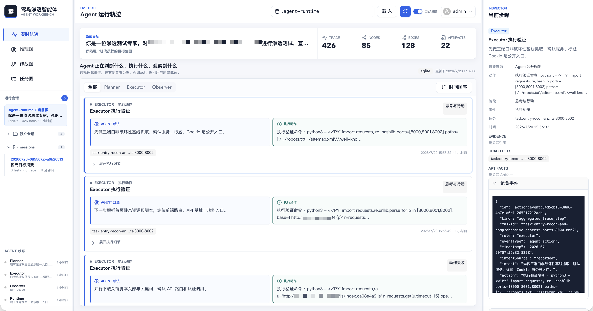
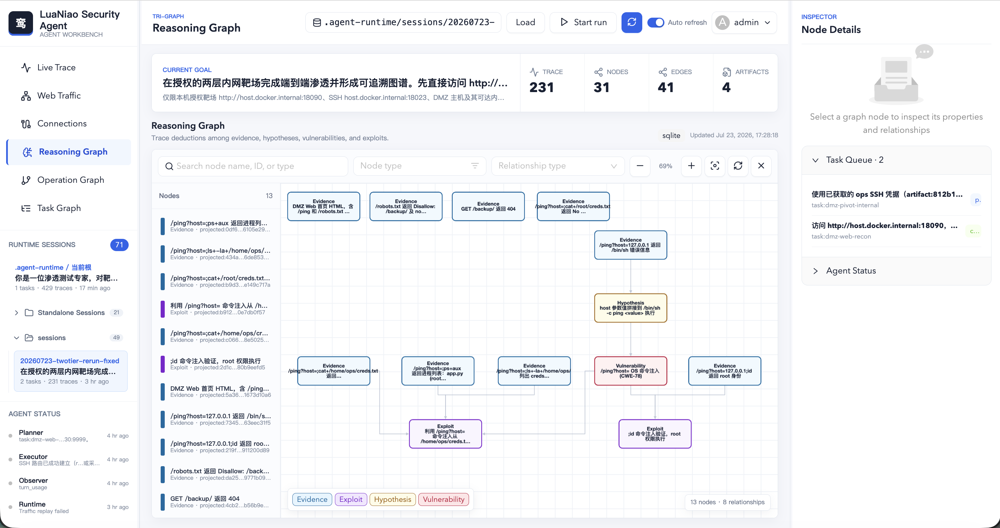
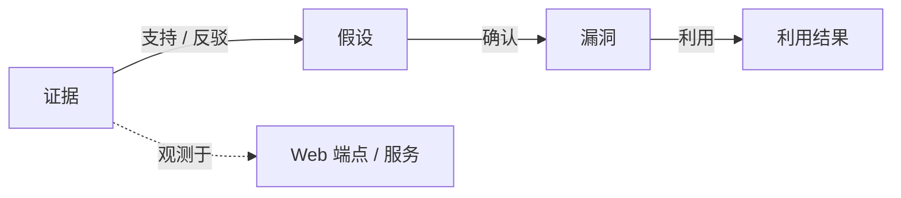
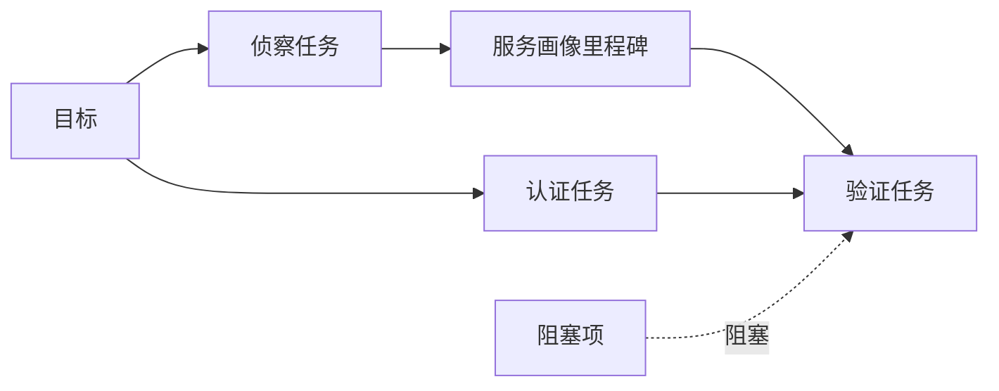
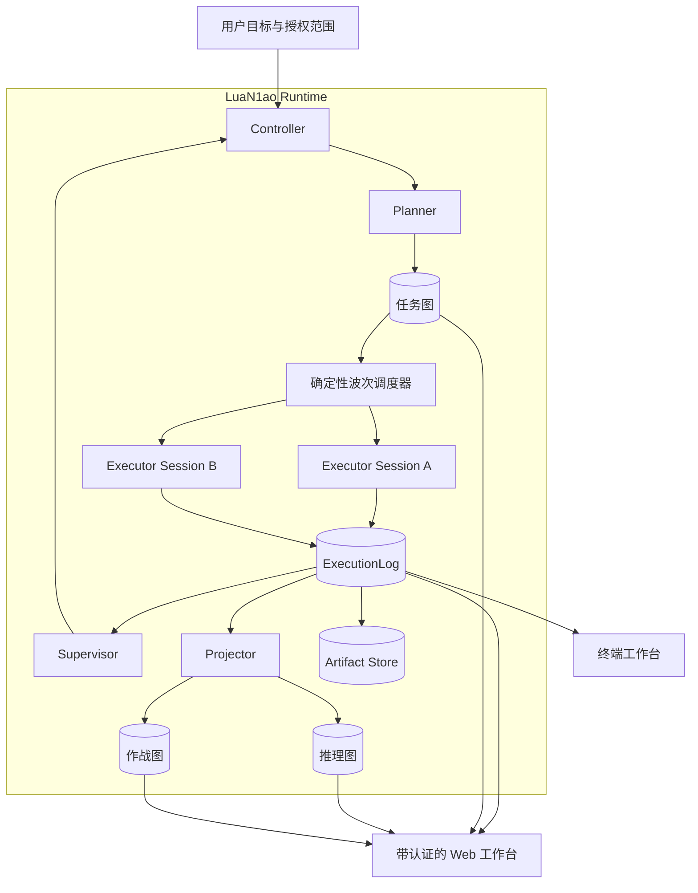

<h1 align="center">LuaN1aoAgent</h1>

<h2 align="center">

**认知驱动的自主安全智能体**

</h2>

<div align="center">

[](https://www.gnu.org/licenses/agpl-3.0.html)
[](https://github.com/SanMuzZzZz/LuaN1aoAgent/releases/latest)
[](https://nodejs.org/)
[](https://www.typescriptlang.org/)
[](#system-architecture)
[](#core-innovations)

</div>

<div align="center">

<a href="https://zc.tencent.com/competition/competitionHackathon?code=cha004"></a>

---

**🧠 以图思考** • **⚙️ 自主行动** • **🔎 保存证据** • **🧭 全程可观测**

[🚀 快速开始](#quick-start) • [✨ 核心创新](#core-innovations) • [🖥️ 项目展示](#showcase) • [🧩 Skills](#recommended-skills) • [🏗️ 系统架构](#system-architecture) • [🗓️ 路线图](#roadmap)

[🌐 中文版](README_CN.md) • [English](README.md)

</div>

---

## 📖 项目简介

**LuaN1aoAgent v2** 是 LuaN1aoAgent 的完整重写版本，基于 TypeScript 与 Pi SDK 构建，面向自主、经过授权的安全研究。

v2 延续原项目的认知驱动方向，并围绕明确的 Agent 边界、持久事件与 Artifact、证据支撑的图记忆以及可观测工具动作重建运行时。

LuaN1aoAgent v2 将职责拆分为三类角色：

- **Planner**：控制目标、范围、依赖关系、任务预算和图级调度。
- **Executor**：自主决定如何完成一个有界任务，并在隔离工作区内执行工具循环。
- **Observer**：以两种独立模式运行；热路径上的 **Supervisor** 负责控制决策，异步 **Projector** 负责持久图更新。

系统围绕一个原则设计：每个重要结论都必须能够追溯到持久事件、Artifact 和图证据。

> [!IMPORTANT]
> LuaN1aoAgent v2 不是 Python v1 运行时的原地重构，而是一个具有不同配置、持久化、Agent 生命周期和可观测性契约的新实现。

> [!NOTE]
> v1 已公布的 Benchmark 结果不会自动归属于 v2。只有在冻结版本上完成可复现重跑后，才会发布 v2 的 Benchmark 结果。

<p align="center">
  <a href="https://github.com/SanMuzZzZz/LuaN1aoAgent">
    
  </a>
</p>

---

## <a id="showcase"></a>🖥️ 项目展示

<p align="center">
  
</p>

<p align="center"><strong>实时轨迹</strong> — 查看每个 Agent 正在思考什么、执行什么动作、关联哪个任务，以及保存了哪些 Artifact。</p>

<p align="center">
  
</p>

<p align="center"><strong>因果推理图</strong> — 从证据追踪到假设、已确认漏洞与成功利用。</p>

---

## <a id="core-innovations"></a>🚀 核心创新

### 1️⃣ **Planner-Executor-Observer 协作** ⭐⭐⭐

v2 使用明确的运行时边界，替代共享历史的 P-E-R 循环。

#### Planner

- 读取压缩后的任务图、推理图和作战图视图。
- 创建或修改目标级任务，而不是规定低层动作。
- 控制依赖关系、优先级、并行组、范围和任务预算。
- 每个规划周期调度一个确定性的准入任务波次。
- 通过结构化终止工具 `planner_submit` 提交决策。

#### Executor

- 接收有界 `TaskEnvelope`，独立选择工具策略。
- 记录公开意图、工具输入、工具输出、用量、错误和最终任务结果。
- 将大输出保存为不可变 Artifact，而不是持续膨胀 Agent 上下文。
- 通过结构化终止工具 `task_result_submit` 提交结果。

#### Observer

- **Supervisor 模式**检查近期 Executor 动作，并决定继续、checkpoint、停止或交回 Planner。
- **Projector 模式**将规范化观察异步转换为具有证据引用的推理图和作战图增量。
- 每次调用使用新的 Pi Session，不共享隐藏模型历史。
- Supervisor 和 Projector 分别通过 `control_submit` 与 `graph_delta_submit` 提交结果。

### 2️⃣ **Causal Graph Reasoning 因果图推理** ⭐⭐⭐

LuaN1ao 将观察结果转换为显式、可追溯的推理链，而不是把关键结论隐藏在模型历史中：



- **证据优先**：推理节点和边保留支撑它们的执行事件引用。
- **显式不确定性**：假设、已确认漏洞和成功利用保持为不同语义层级。
- **强制来源约束**：已确认 `Vulnerability` 节点和成功 `Exploit` 节点没有证据引用时无法写入。
- **异步图投影**：Observer Projector 将规范化执行观察转换为图增量，不阻塞 Executor 工具循环。
- **跨图关联**：推理图中的结论与作战图中的具体端点、服务和会话保持关联。

### 3️⃣ **Plan-on-Graph 动态任务规划** ⭐⭐⭐

Planner 维护持续演化的任务图，而不是反复生成线性任务清单：



- **结构化图操作**：`create_tasks`、`patch_task`、`replace_dependencies`、`set_task_status` 和 `set_node_status` 组成规划语言。
- **局部动态调整**：新证据只修改相关任务和依赖，不丢弃整张计划。
- **依赖感知调度**：只有依赖就绪的任务进入确定性准入波次；相互独立的任务可以并发执行。
- **证据支撑决策**：每个 Planner 命令都有明确原因，并可引用其依据的图节点或事件。
- **任务与动作分离**：目标、任务、里程碑、阻塞项和范围进入任务图；低层工具动作保留在追加写的 ExecutionLog 中。

| 能力 | 线性任务列表 | LuaN1ao PoG |
|---|---|---|
| 计划结构 | 有序步骤 | 依赖图 |
| 动态调整 | 重新生成整份计划 | 修改受影响的节点和边 |
| 调度 | 人工排序 | 依赖感知的准入波次 |
| 可追溯性 | 自然语言历史 | 结构化命令和持久事件 |

### 4️⃣ **证据与 Artifact 保真** ⭐⭐⭐

每个 Pi 事件在进入运行时账本前都会被规范化：

- 公开 Agent 意图与工具调用分开保存。
- 工具开始和结束事件保留对应的 `toolCallId`。
- 小输出以内联形式保存，便于立即检查。
- 大输出写入内容寻址 Artifact，仅在事件中保留 preview 和来源引用。
- Projector 输入使用有界观察批次和显式 Artifact 引用。
- 已确认的漏洞和利用节点必须具有证据引用。

---

## 🧰 核心能力

### 结构化 Agent 控制

- 使用 Schema 验证 Planner、Executor、Supervisor 和 Projector 的终止提交。
- 依赖感知的并行调度和确定性任务准入。
- 单任务轮次预算和全局运行时间预算。
- 可重试 Provider 错误分类以及有界的新 Session 重试。
- 显式 Planner 冲突检测和原子命令批次。

### 工具运行时

Executor 在配置的沙箱边界内使用 Pi coding tools：

- `read`、`grep`、`find` 和 `ls`：检查工作区。
- `bash`：受控执行命令。
- `web_fetch`：抓取公开 HTTP(S) 参考资料、公告和 PoC Writeup，并转换为有界 Markdown preview。
- `web_search`：优先使用 `BRAVE_SEARCH_API_KEY` 或 `BRAVE_API_KEY` 调用 Brave Search；未配置时使用公开 HTML 搜索回退。
- `vulnerability_search`：通过 NVD 与公开 Web 资料检索 CVE/公告/历史漏洞；没有命中时保留弱负面语义，避免误判为目标不存在漏洞。
- `artifact_read` 和 `artifact_write`：保存可跨任务复用的持久材料。
- `task_result_submit`：结构化完成任务或提交 checkpoint。

公开情报结果只作为假设或线索，Executor 必须再用沙箱工具在授权目标上验证。可选 `NVD_API_KEY` 可提升 NVD 查询限额，但不是必需项。

Planner 使用 `graph_query` 和 `graph_trace` 获取压缩任务、推理、作战和会话视图。Executor 不直接访问控制面 GraphStore，而是接收 Runtime 选取的图闭包和依赖任务结果。

### <a id="recommended-skills"></a>推荐 Agent Skills

LuaN1ao 通过 Pi Runtime 使用 Agent Skills 约定。推荐按需安装以下社区能力包，为 Executor 补充安全测试资料与专项工作流：

| Skills 集合 | 适用方向 |
|---|---|
| [crazyMarky/pentest-skills](https://github.com/crazyMarky/pentest-skills) | 自然语言驱动的渗透测试工作流：信息收集（端口扫描、子域名枚举、目录扫描、指纹/WAF 识别）与漏洞利用（SQLi、XSS、LFI、文件下载），以及报告类技能 |
| [Eyadkelleh/awesome-skills-security](https://github.com/Eyadkelleh/awesome-skills-security) | Fuzzing Payload、密码与用户名字典、敏感信息模式、WebShell 样本和 LLM 安全测试资料 |
| [ljagiello/ctf-skills](https://github.com/ljagiello/ctf-skills) | Web、Pwn、Crypto、逆向、取证、OSINT、AI/ML、恶意代码分析和 Writeup 等 CTF 与靶场工作流 |

在仓库根目录执行一键安装脚本 —— 将三个推荐 Skills 集合全部安装到项目本地 `.agents/skills/`，然后执行 `npm ci` 和 `npm run build`：

```bash
./install.sh
```

也可以用 skills 安装器单独安装某个集合：

```bash
npx skills add Eyadkelleh/awesome-skills-security \
  --skill '*' --agent pi --global --yes

npx skills add ljagiello/ctf-skills \
  --skill '*' --agent pi --global --yes
```

`./install.sh` 安装的技能位于项目本地 `.agents/skills/`（已加入 gitignore）。Executor 会话通过运行时的 additional skill paths 加载它们，Executor 沙箱也将该目录加入读白名单。它们是独立第三方项目，分别遵循各自的许可证和更新周期。

### 沙箱隔离

- macOS 在可用时通过 `sandbox-exec` 使用 Seatbelt。
- Linux 支持 Bubblewrap 隔离。
- Executor 工作区和运行时根目录会被显式解析。
- 强制沙箱模式下，访问允许根目录之外的宿主路径会失败关闭。
- Agent 运行时状态不会作为隐式上下文暴露给隔离的 Executor Session。

### 持久运行状态

每次新的 CLI 调用都会在 `.agent-runtime/sessions/<session>/` 下创建独立 Session。TUI 启动时会显示选中的 Session 路径。每个 Session 包含：

| 路径 | 用途 |
|---|---|
| `state.sqlite` | 图、执行事件、Projector 水位、Artifact 和运行时状态 |
| `execution.jsonl` | 规范执行事件的追加写审计镜像 |
| `graph-deltas.jsonl` | 可回放的图增量镜像 |
| `artifacts/` | 大输出和持久任务 Artifact |
| `web-auth.sqlite` | 本地 Web 工作台用户和 Session |

---

## 📋 系统要求

| 组件 | 要求 | 说明 |
|---|---|---|
| 操作系统 | macOS 或 Linux | Windows 尚未作为 v2 发布目标进行验证 |
| Node.js | 25+ | 必须支持 v2 使用的内置 `node:sqlite` 运行时 |
| LLM API | OpenAI 兼容 | 默认使用 Chat Completions，可选 Responses API |
| 终端 | 支持 ANSI 的 TTY | 交互式 Agent 时间线所需 |
| 浏览器 | 当前版本 Chromium、Firefox 或 Safari | 用于带认证的 Web 工作台 |

> [!WARNING]
> Executor 工具能够运行 Shell 命令。请使用隔离主机、虚拟机或容器，并将每次运行限制在明确获得授权的目标范围内。

---

## <a id="quick-start"></a>🚀 快速开始

### 1. 克隆与安装

```bash
git clone https://github.com/SanMuzZzZz/LuaN1aoAgent.git
cd LuaN1aoAgent
npm ci
npm run build
```

### 2. 配置 LLM 运行时

创建本地 `.env` 文件：

```ini
LLM_API_KEY=your-api-key
LLM_API_BASE_URL=https://api.openai.com/v1
LLM_DEFAULT_MODEL=your-model-id

# 可选：openai-completions 或 openai-responses
LLM_API_TYPE=openai-completions
```

v2 会读取本地 `.env`。该文件已被 Git 忽略，绝不能提交。

### 3. 启动 Agent 运行

```bash
npm start -- \
  --goal "在授权范围内评估 http://127.0.0.1:8080" \
  --scope "仅限 http://127.0.0.1:8080" \
  --max-cycles 8 \
  --max-parallel-tasks 2
```

当 stdin 和 stdout 连接到 TTY 时，交互式 Agent 时间线会自动启动。
不使用 `--resume` 启动时始终创建新 Session，不会读取旧任务图。

恢复一个指定的未完成 Session，无需重复或替换其 Goal 与授权 Scope：

```bash
npm start -- --resume 20260720-080000Z-a1b2c3d4
```

`--resume` 接受 `.agent-runtime/sessions/` 下的 Session 名称或完整运行时路径。恢复时不要传入 `--goal` 或 `--scope`。

### CLI 参数

```text
--goal <text>                Agent 目标
--scope <text>               授权范围摘要
--runtime-dir <path>         新运行使用的空目录
--resume <session>           恢复一个运行，同时恢复 Goal 与 Scope
--max-cycles <number>        Planner 最大循环数
--max-parallel-tasks <n>     最大并行任务数
--max-run-time-ms <number>   全局运行超时，单位毫秒
--json                       禁用 TUI，输出最终 JSON
--jsonl                      以 JSON Lines 流输出持久事件
--no-tui                     禁用交互式 TUI
--help                       显示 CLI 帮助
```

### 交互式快捷键

| 按键 | 操作 |
|---|---|
| `Up` / `Down` | 选择上一个或下一个 Agent Action |
| `Enter` | 展开或收起选中的 Action |
| `Tab` / `Shift+Tab` | 在全部任务和单任务视图之间切换 |
| `Ctrl+C` | 优雅中断当前运行 |

### 机器可读执行

当其他进程需要完整持久事件流时，可以使用 JSON Lines：

```bash
npm start -- \
  --goal "检查获得授权的目标" \
  --scope "仅限 localhost" \
  --jsonl
```

最终 JSONL 记录的 `type` 为 `result`；此前的记录类型为 `event`。

---

## <a id="agent-workbench"></a>🖥️ Agent 工作台

v2 为同一个持久运行时提供两种观察界面。

### 终端工作台

TUI 聚焦实时执行循环：

- Planner 和 Runtime 状态迁移。
- 任务范围内的 Agent 意图。
- 关联后的工具调用和结果 preview。
- 可展开的内联输出，以及按需加载的 Artifact 详情；终端中每个 Artifact 最多加载 64 KiB。
- 并行 Executor 身份和聚合任务状态。
- 优雅中断反馈。

### Web 工作台

针对所选 CLI Session 目录启动带认证的 Web 服务：

```bash
npm run web -- --runtime-dir .agent-runtime/sessions/<session> --port 8787
```

打开 <http://127.0.0.1:8787>。首个注册用户成为管理员，后续用户为分析员。

Web 工作台主要用于观察：读取持久图、事件、Artifact 和运行状态。它也支持在 Web 进程内启动新任务（填写目标与授权范围）并优雅停止由本进程启动的任务；CLI 启动的 run 仍可被观察，但不能从 Web 侧停止。

所有 `/api/*` 流量与连接端点都要求有效 Session。分析员可以读取运行时元数据、敏感代理历史和连接状态，但连接生命周期变更要求管理员专属的 `connectivity:manage` capability；服务不暴露流量删除/导出端点。GET 请求豁免 CSRF，变更请求必须携带同源 double-submit token。所有 runtime 路径（包括符号链接）都会 canonicalize 并限制在配置的 `--runtime-dir` 根目录内，因此 API 不能充当任意文件系统浏览器。

受管 traffic-proxy sidecar 将数据保存在 `<runtime>/traffic-proxy/data`，提供基于 cursor 的历史列表、交换详情、请求/响应捕获 body 与经过认证的公共 CA 下载 API。body 使用 base64 编码，单次读取最多 256 KiB。只能下载 `ca.crt`，私钥永不暴露。Web 启动的 Executor 会收到一份独立环境副本，其中设置 `HTTP_PROXY`、`HTTPS_PROXY`、`NO_PROXY`、`SSL_CERT_FILE` 和 `CURL_CA_BUNDLE`；`ALL_PROXY` 会被删除，同时不会修改进程全局环境，也不会强制使用 Bash。sidecar 启动/附着/停止、CA 创建和代理就绪会写入 `ExecutionLog`，且不记录路径、Secret 或证书内容。

侧边栏的 **Web Traffic** 页面提供 method、host、status、task/run reference、mode 和 error 精确过滤，以最新记录优先的 opaque cursor 分页展示，并按需加载 exchange 详情。请求和响应 body 仅在点击后读取，单次最多 256 KiB，可显示为 UTF-8/JSON、base64 或 hex；非法 UTF-8 会回退到 base64。header 和 body 以转义后的文本而非 HTML 渲染，并明确标记 metadata-only、已淘汰、best-effort 与 truncated 状态。这是安全渲染而非脱敏：获得权限的分析员仍能看到已捕获的凭据及其他敏感值。

Replay 仅限管理员；分析员可以查看 exchange，但不能 replay。端点为 `POST /api/traffic/history/:id/replay`，受 Session 授权与同源 double-submit CSRF 校验保护。`runtimeDir` 以及可选的 method、URL、header、body、route、session、task 和 run overrides 都必须位于 allowlist JSON request body，而不是 query string。Web body override 使用 base64，当前 `data` 限制为 16 KiB 字符。确认框只显示目标摘要与数量；`ExecutionLog` 通过服务端生成的用户/runtime 归因及稳定结果/错误标识记录 `traffic_replay_requested`、`traffic_replay_succeeded` 或 `traffic_replay_failed`，绝不记录 override URL、header、body 或其他请求 Secret。

Replay 持久化为独立的 `mode=replay` exchange，`replay_of` 指向不可变的源 exchange。control protocol v1 提供 `replay` command，请求 frame 上限为 64 KiB、响应 frame 上限为 1 MiB；sidecar 对每个 `runtime_ref` 最多并发 4 个 replay，最多捕获 1 MiB replay 响应，并应用 30 秒 replay/control deadline；Web Server 另有全局 4 个 replay 请求的并发限制。Web control client 对 replay 使用专用的 35 秒等待时间，让 sidecar 能返回自身的 timeout 结果；其他 control command 仍使用默认 2 秒。错误使用稳定的机器可读 code 返回，不暴露底层敏感值。

Replay 只接受绝对 HTTP(S) 目标，使用 TLS 1.2+ 严格校验证书与主机名；允许私网/RFC1918 目标，但拒绝已配置的代理 self-loop。它拒绝 `CONNECT`、URL userinfo/control character、hop-by-hop header（包括 `Connection` 指定的 header）、proxy authentication header，以及与 URL authority 冲突的 `Host`。metadata-only/passthrough、CONNECT、header/request 已截断、或捕获的 request body 缺失/不完整的源记录不可 replay。系统没有流量 export/delete endpoint。

traffic manager/client 提供受管 HTTP scope，将 task/run 归因与非空 `routeRef`、`sessionRef` 组合应用。只有在该 scope 内执行的操作才携带这些 route/session reference；raw 或 unmanaged 流量仍可观测，但绝不会被自动归因。

侧边栏的 **Connections** 页面展示 tunnel/session 的方向、transport、desired/observed state、heartbeat、可用性、错误与 operation graph 链接。管理员可在 UI 控制已有受管 SSH tunnel 和 SSH session 的 desired lifecycle；定义目前通过管理员专属 API 创建，分析员只能读取。请求只能提供 `credentialRef`，递归出现的明文密码、私钥、token 或其他凭据内容都会被拒绝；所有变更还受 CSRF、capability 校验和 runtime 根目录 containment 保护。Chisel adapter 已有配置与 allowlist 集成，但目前尚未接入 Web 生命周期控制；raw、unmanaged 和 Chisel 记录在该页面仅展示状态。

---

## <a id="system-architecture"></a>🏗️ 系统架构



### 运行时不变量

- Planner 拥有任务图决策权；Executor 永远不会修改任务拓扑。
- Executor 在 `TaskEnvelope` 边界内拥有低层动作选择权。
- Supervisor 控制是否继续，但不会投影语义图事实。
- Projector 写入推理图和作战图，但不能修改任务节点。
- 每次 Agent 调用都具有显式终止工具契约。
- Projector 的期望水位和已提交水位单调递增。
- 图变更和已提交 Projector 水位具有原子性。
- 持久事件和 Artifact 是可观测性的事实来源。

### 仓库结构

```text
LuaN1aoAgent/
├── src/
│   ├── agents.ts                 # Planner、Executor 与 Observer Session 工厂
│   ├── controller.ts             # 调度、生命周期、监督与恢复
│   ├── pi-runner.ts              # Pi 调用和规范事件记录
│   ├── projection.ts             # 观察与图投影契约
│   ├── executor-sandbox.ts       # macOS/Linux Executor 隔离
│   ├── stores/
│   │   ├── execution-log.ts      # 持久事件账本
│   │   ├── graph-store.ts        # 三图持久化与原子变更
│   │   ├── runtime-store.ts      # 执行与 Projector 运行状态
│   │   └── artifact-store.ts     # 内容寻址 Artifact
│   ├── tools/                    # Pi 图、Artifact 与运行时工具
│   ├── tui/                      # 交互式终端工作台
│   ├── cli.ts                    # CLI 入口
│   └── web-server.ts             # 带认证的工作台服务（可启动/停止任务）
├── web/                          # React Agent 工作台
├── test/                         # 运行时与迁移测试
├── package.json
└── README.md
```

---

## 🔄 v1 到 v2

| 领域 | v1 | v2 |
|---|---|---|
| 运行时 | Python | TypeScript + Pi SDK |
| Agent 模型 | Planner / Executor / Reflector | Planner / Executor / Observer |
| Observer 行为 | 共享反思循环 | 独立 Supervisor 与 Projector 调用 |
| 记忆 | 任务图与因果图状态 | 任务图、推理图和作战图 |
| 证据 | 混合运行时与图记录 | 规范事件、Artifact 和证据引用 |
| 并行 | 共享运行时协调 | 确定性准入波次和任务级 Session |
| 终端 | 格式化日志 | 交互式分组 Action 时间线 |
| Web UI | 任务管理面板 | 带认证的运行时可观测工作台 |

Python v1 实现继续通过 [`v1` 分支](https://github.com/SanMuzZzZz/LuaN1aoAgent/tree/v1)和 [`v1.0.0` Release](https://github.com/SanMuzZzZz/LuaN1aoAgent/releases/tag/v1.0.0)提供。

---

## <a id="roadmap"></a>🗓️ 路线图

- [x] Pi SDK Planner、Executor 和 Observer 运行时
- [x] 三图持久化和证据投影
- [x] 并行任务准入和隔离 Executor Session
- [x] 隔离任务 Session 和优雅中断
- [x] 带认证的 Web 可观测工作台
- [x] 交互式分组 Action 终端时间线
- [ ] 用于扩展工具的稳定 v2 Extension API
- [ ] 高风险动作的人类审批门
- [ ] 打包后的容器运行时和部署配置
- [ ] 可复现的 v2 公共 Benchmark 套件
- [ ] 具有明确来源的跨运行能力记忆

---

## 🧪 开发

```bash
# 编译服务端和 Web UI
npm run build

# 运行全部服务端与 Web 测试
npm test

# 仅运行 Web 测试
npm run test:web

# 启动 Web UI 开发服务器
npm run web:dev
```

---

## 🔐 安全声明

**本软件仅用于获得授权的安全测试、受控研究和教育。**

下载、安装或使用 LuaN1ao 即表示你确认：

- 必须获得每个被测系统所有者的明确授权。
- 你有责任定义并执行允许的测试范围。
- 软件可以执行 Shell 命令并与网络服务交互。
- 沙箱边界可以降低风险，但不能替代宿主隔离。
- 软件按“原样”提供，不附带任何保证或担保。
- 维护者和贡献者不对滥用造成的损害、数据丢失或法律后果负责。

请仅在隔离环境中运行 LuaN1ao，未经书面授权不得针对生产系统。

---

## 👥 贡献者

[](https://github.com/SanMuzZzZz/LuaN1aoAgent/graphs/contributors)

---

## 🤝 参与贡献

欢迎提交 Bug 报告、运行时测试、文档、工具集成和架构改进。

1. 通过 [Issue](https://github.com/SanMuzZzZz/LuaN1aoAgent/issues) 提交 Bug 或设计建议。
2. Fork 仓库并创建聚焦的开发分支。
3. 为每个发生变化的 Agent 或运行时边界添加测试。
4. 提交 Pull Request，并附上行为变化和验证证据。

---

## 📝 许可证

LuaN1aoAgent v2 采用 [GNU Affero General Public License v3.0](LICENSE)（`AGPL-3.0-only`），仅供个人和教育用途使用。

**商业使用**：如果您希望在商业或专有环境中使用本项目，同时不受 AGPL-3.0 开源义务约束，**请[联系维护者](#-联系方式)获取商业许可证。**

**参与贡献**：提交 Pull Request 即表示您同意，您的贡献可同时用于 AGPL-3.0 版本及本项目的商业许可版本。

---

## 📞 联系方式

- GitHub Issues：[SanMuzZzZz/LuaN1aoAgent Issues](https://github.com/SanMuzZzZz/LuaN1aoAgent/issues)
- GitHub Discussions：[SanMuzZzZz/LuaN1aoAgent Discussions](https://github.com/SanMuzZzZz/LuaN1aoAgent/discussions)
- Email：<1614858685x@gmail.com>
- WeChat：`SanMuzZzZzZz`

---

## ⭐ Star History

[](https://www.star-history.com/?repos=SanMuzZzZz%2FLuaN1aoAgent&type=date&legend=top-left)
