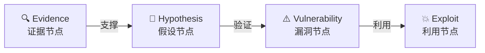
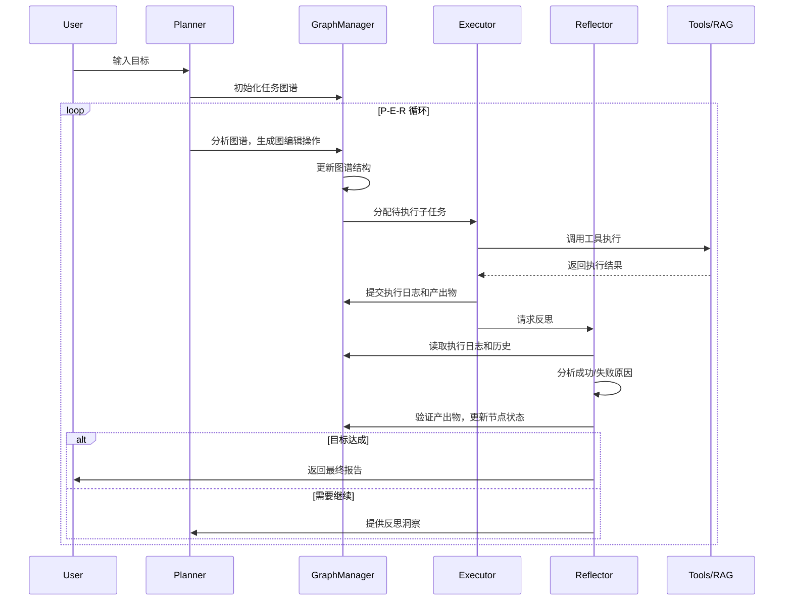

<h1 align="center">鸾鸟<br>LuaN1ao</h1>

<h2 align="center">

**基于大模型的自主渗透测试智能体**

**Autonomous Penetration Testing Agent driven by LLMs**
</h2>

<div align="center">

[](https://opensource.org/licenses/MIT)
[](https://www.python.org/downloads/)
[](CONTRIBUTING.md)
[](#-系统架构)
[](#)

---

**🧠 像人类专家一样思考** • **📊 动态图谱规划** • **🔄 从失败中学习** • **🎯 证据驱动决策**

[🚀 快速开始](#-快速开始) • [✨ 核心创新](#-核心创新) • [🏗️ 系统架构](#system-architecture) • [🗓️ 路线图](#roadmap)

[🌐 中文版](README_zh.md) • [English Version](README.md)

</div>

---

## 📖 简介

**鸾鸟 (LuaN1ao)** 是新一代**基于大模型的自主渗透测试智能体**。

传统自动化扫描工具依赖预定义规则，难以应对复杂多变的实战场景。鸾鸟突破这一局限，创新性地融合了 **P-E-R (Planner-Executor-Reflector) 智能体协同框架**与**因果图谱推理 (Causal Graph Reasoning)** 技术。

鸾鸟模拟人类安全专家的思维方式：
- 🎯 **战略规划**：基于全局态势动态规划攻击路径
- 🔍 **证据驱动**：构建严密的"证据-假设-验证"逻辑链
- 🔄 **持续进化**：从失败中学习，自主调整战术策略
- 🧠 **认知闭环**：规划-执行-反思，形成完整的认知循环

从信息收集到漏洞利用，鸾鸟将渗透测试从"自动化工具"提升为"自主智能体"。

<p align="center">
  <a href="https://github.com/SanMuzZzZz/LuaN1aoAgent">
      
  </a>
</p>

---

## 🖼️ 展示

<p align="center">
  
  
</p>

> 💡 _更多演示内容即将推出！_

---

## 🚀 核心创新

### 1️⃣ **P-E-R 智能体协同框架** ⭐⭐⭐

鸾鸟将渗透测试思维解耦为三个独立且协作的认知角色，形成完整的决策闭环：

- **🧠 Planner (规划器)**
  - **战略层大脑**：基于全局图谱进行动态规划
  - **自适应能力**：识别死胡同，自动生成备选路径
  - **图操作驱动**：输出结构化的图编辑指令而非自然语言
  - **并行调度**：基于拓扑依赖自动识别可并行执行的任务

- **⚙️ Executor (执行器)**
  - **战术层执行**：专注于单一子任务的工具调用和结果分析
  - **工具编排**：通过 MCP (Model Context Protocol) 统一调度安全工具
  - **上下文压缩**：智能管理消息历史，避免 token 溢出
  - **容错重试**：自动处理网络瞬时错误和工具调用失败

- **⚖️ Reflector (反思器)**
  - **审计分析**：复盘任务执行，验证产出物有效性
  - **失败归因**：L1-L4 级失败模式分析，防止重复错误
  - **情报生成**：提取攻击情报，构建知识积累
  - **终止控制**：判断目标达成或任务陷入困境

**关键优势**：角色分离避免了单一 Agent 的"精神分裂"问题，每个组件专注于其核心职责，通过事件总线协作。

### 2️⃣ **因果图谱推理 (Causal Graph Reasoning)** ⭐⭐⭐

鸾鸟拒绝盲目猜测和大模型幻觉，构建显式的因果图谱来驱动测试决策：



**核心原则**：
- **证据必须先行**：任何假设都需要明确的前置证据支撑
- **置信度量化**：每个因果边都有置信度评分，避免盲目推进
- **可追溯性**：完整记录推理链条，支持失败溯源和经验复用
- **防止幻觉**：强制要求证据验证，拒绝无根据的攻击尝试

**示例场景**：
```
Evidence: 端口扫描发现 3306/tcp 开放
  ↓ (置信度 0.8)
Hypothesis: 目标运行 MySQL 服务
  ↓ (验证成功)
Vulnerability: MySQL 弱口令/未授权访问
  ↓ (尝试利用)
Exploit: mysql -h target -u root -p [爆破/空密码]
```

### 3️⃣ **Plan-on-Graph (PoG) 基于图的动态任务规划** ⭐⭐⭐

告别静态任务清单，鸾鸟将渗透测试计划建模为动态演进的**有向无环图 (DAG)**：

**核心特性**：
- **图操作语言**：Planner 输出标准化的图编辑操作 (`ADD_NODE`, `UPDATE_NODE`, `DEPRECATE_NODE`)
- **实时自适应**：任务图随测试进度实时变形
  - 发现新端口 → 自动挂载服务扫描子图
  - 遇到 WAF → 插入绕过策略节点
  - 路径不通 → 自动修剪或分支规划
- **拓扑依赖管理**：基于 DAG 拓扑自动识别并**并行执行**无依赖任务
- **状态追踪**：每个节点包含状态机 (`pending`, `in_progress`, `completed`, `failed`, `deprecated`)

**与传统规划的对比**：

| 特性 | 传统 Task List | Plan-on-Graph |
|------|----------------|---------------|
| 结构 | 线性列表 | 有向图谱 |
| 依赖管理 | 手动排序 | 拓扑自动排序 |
| 并行能力 | 无 | 自动识别并行路径 |
| 动态调整 | 重新生成 | 局部图编辑 |
| 可视化 | 困难 | 原生支持 (Web UI) |

**可视化示例**：启动 `--web` 模式后，可在浏览器实时查看任务图的演化过程。

---

## 核心能力

### 工具集成 (MCP Protocol)
鸾鸟通过 **Model Context Protocol (MCP)** 实现工具的统一集成和调度：

- **HTTP/HTTPS 请求**：支持自定义 Headers、代理、超时控制
- **Shell 命令执行**：安全封装的系统命令调用（建议容器化运行）
- **Python 代码执行**：动态执行 Python 脚本用于复杂逻辑处理
- **元认知工具**：`think`（深度思考）、`hypothesize`（假设生成）、`reflect`（经验总结）
- **任务控制**：`halt_task`（提前终止任务）

> 💡 **扩展性**：可通过 `mcp.json` 轻松集成新工具（如 Metasploit、Nuclei、Burp Suite API）

### 知识增强 (RAG)
- **向量检索**：基于 FAISS 的高效知识库检索
- **领域知识**：集成 PayloadsAllTheThings 等开源安全知识库
- **动态学习**：可持续添加自定义知识文档

### Web 可视化
- **实时监控**：浏览器查看任务图谱的动态演化
- **节点详情**：点击节点查看执行日志、产出物、状态转换
- **进度追踪**：可视化并行任务执行和依赖关系

---

## <a id="roadmap"></a>🗓️ Roadmap 规划路线

- [ ] **经验自进化 (Experience Self-Evolution)**
  - 跨任务长期记忆 (Long-term Memory)
  - 自动提取成功攻击模式并存入向量库
  - 基于历史经验的智能推荐

- [ ] **人机协同模式 (Human-in-the-Loop)**
  - 高危操作前的人工确认机制
  - 运行时任务图谱编辑界面 (Graph Injection)
  - 专家干预和策略注入

- [ ] **工具生态扩容**
  - 集成 Metasploit RPC 接口
  - 支持 Nuclei、Xray、AWVS 等扫描器
  - Docker 沙箱化工具执行环境

- [ ] **多模态能力**
  - 图像识别（验证码、截图分析）
  - 流量分析（PCAP 文件解析）

### 长期愿景
- [ ] **协作智能体网络**：多 Agent 分布式协作
- [ ] **强化学习集成**：通过与环境交互自主优化攻击策略，实现智能体在复杂场景下的自我进化和策略收敛
- [ ] **合规报告生成**：自动生成符合标准的渗透测试报告

---

## 📋 系统要求

| 组件 | 要求 | 说明 |
|------|------|------|
| **操作系统** | Linux (推荐) / macOS / Windows (WSL2) | 建议在隔离环境中运行 |
| **Python** | 3.10+ | 需要支持 asyncio 和类型提示 |
| **LLM API** | OpenAI 兼容格式 | 支持 GPT-4o, DeepSeek, Claude-3.5 等 |
| **内存** | 最小 4GB，推荐 8GB+ | RAG 服务和 LLM 推理需要内存 |
| **网络** | 互联网连接 | 访问 LLM API 和更新知识库 |

> ⚠️ **安全提示**：鸾鸟包含 `shell_exec` 和 `python_exec` 等高权限工具，**强烈建议在 Docker 容器或虚拟机中运行**，避免对宿主机造成潜在风险。

---

## 🚀 快速开始

### 步骤 1：安装

```bash
# 克隆仓库
git clone https://github.com/SanMuzZzZz/LuaN1aoAgent.git
cd LuaN1aoAgent

# 创建虚拟环境（推荐）
python3 -m venv venv
source venv/bin/activate  # Linux/macOS
# Windows: venv\Scripts\activate

# 安装依赖
pip install -r requirements.txt
```

> 💡 完整的安装与故障排查指南，请参阅 [QUICKSTART.md](QUICKSTART.md)

### 步骤 2：配置

#### 2.1 环境变量配置

```bash
# 复制配置模板
cp .env.example .env

# 编辑 .env 文件
nano .env  # 或使用你喜欢的编辑器
```

**核心配置项**：
```ini
# LLM API 配置（必填）
LLM_API_KEY=sk-xxxxxxxxxxxxxxxxxxxxxxxx
LLM_API_BASE_URL=https://api.openai.com/v1

# 推荐使用强大模型以获得更好效果
LLM_DEFAULT_MODEL=gpt-4o
LLM_PLANNER_MODEL=gpt-4o    # 规划器需要强推理能力
LLM_EXECUTOR_MODEL=gpt-4o
LLM_REFLECTOR_MODEL=gpt-4o

OUTPUT_MODE=default    # simple/default/debug
```

#### 2.2 知识库初始化（首次运行必需）

鸾鸟依赖 **RAG (检索增强生成)** 系统获取最新安全知识。首次运行前需初始化知识库：

```bash
# 1. 克隆 PayloadsAllTheThings 知识库
mkdir -p knowledge_base
git clone https://github.com/swisskyrepo/PayloadsAllTheThings \
    knowledge_base/PayloadsAllTheThings

# 2. 构建向量索引（需要几分钟）
python -m rag.rag_kdprepare
```

> **知识库说明**：PayloadsAllTheThings 包含丰富的攻击载荷、绕过技巧和漏洞利用方法，是渗透测试的宝贵资源。

### 步骤 3：运行

#### 基础用法

```bash
# 命令行模式（精简输出）
python agent.py \
    --goal "对 http://testphp.vulnweb.com 进行全面的 Web 安全测试" \
    --task-name "demo_test"
```

#### Web 可视化模式（推荐）

```bash
# 启动 Web UI
python agent.py \
    --goal "对 http://testphp.vulnweb.com 进行全面的 Web 安全测试" \
    --task-name "demo_test" \
    --web

# 打开浏览器访问 http://localhost:8000
# 实时查看任务图谱演化、节点状态、执行日志
```


### 查看结果

任务执行完成后，日志和指标保存在 `logs/TASK-NAME/TIMESTAMP/` 目录：

```
logs/demo_test/20250204_120000/
├── run_log.json          # 完整执行日志（包含所有 P-E-R 交互）
├── metrics.json          # 性能指标和统计数据
└── console_output.log    # 格式化的控制台输出
```

---

## <a id="system-architecture"></a>🏗️ 系统架构

### 整体架构图

```
┌─────────────────────────────────────────────────────────┐
│                  用户目标 (User Goal)                    │
│            "对目标系统进行全面的渗透测试"                 │
└────────────────────────┬────────────────────────────────┘
                         ▼
┌─────────────────────────────────────────────────────────┐
│              P-E-R 认知层 (Cognitive Layer)              │
│  ┌──────────┐      ┌──────────┐      ┌──────────┐      │
│  │ Planner  │ ───> │ Executor │ ───> │Reflector │      │
│  │  规划器   │      │  执行器   │      │  反思器   │      │
│  └──────────┘      └──────────┘      └──────────┘      │
│       │                  │                  │            │
│       └──────────────────┴──────────────────┘            │
│                         ▲                                │
│                         │  LLM API 调用                   │
└─────────────────────────┼────────────────────────────────┘
                          │
┌─────────────────────────┴────────────────────────────────┐
│               核心引擎 (Core Engine)                      │
│  ┌────────────────────────────────────────────────┐     │
│  │ GraphManager                                   │     │
│  │ • 任务图谱管理 (DAG)                            │     │
│  │ • 状态追踪与更新                                 │     │
│  │ • 拓扑排序与依赖解析                             │     │
│  │ • 并行任务调度                                   │     │
│  └────────────────────────────────────────────────┘     │
│  ┌────────────────────────────────────────────────┐     │
│  │ EventBroker                                    │     │
│  │ • 组件间通信                                     │     │
│  │ • 事件发布/订阅                                  │     │
│  └────────────────────────────────────────────────┘     │
│  ┌────────────────────────────────────────────────┐     │
│  │ PromptManager                                  │     │
│  │ • Jinja2 模板渲染                               │     │
│  │ • 上下文注入                                     │     │
│  └────────────────────────────────────────────────┘     │
└─────────────────────────┬────────────────────────────────┘
                          │
┌─────────────────────────┴────────────────────────────────┐
│            能力支撑层 (Capability Layer)                  │
│  ┌────────────────────┐  ┌──────────────────────────┐   │
│  │ RAG Knowledge      │  │ MCP Tool Server          │   │
│  │ Service            │  │                          │   │
│  │ • FAISS 向量检索   │  │ • http_request           │   │
│  │ • 知识文档解析     │  │ • shell_exec             │   │
│  │ • 相似度搜索       │  │ • python_exec            │   │
│  │                    │  │ • think/hypothesize      │   │
│  └────────────────────┘  │ • halt_task              │   │
│                          └──────────────────────────┘   │
└──────────────────────────────────────────────────────────┘
```

### P-E-R 协作流程



### 目录结构

```
LuaN1aoAgent/
├── agent.py                    # 主入口，P-E-R 循环控制
├── requirements.txt            # 项目依赖
├── pyproject.toml             # 项目配置和代码质量工具设置
├── mcp.json                   # MCP 工具服务配置
├── .env                       # 环境变量配置（需手动创建）
│
├── conf/                      # 配置模块
│   ├── config.py             # 核心配置项（LLM、场景、参数）
│   └── __init__.py
│
├── core/                      # 核心引擎
│   ├── planner.py            # 规划器实现
│   ├── executor.py           # 执行器实现
│   ├── reflector.py          # 反思器实现
│   ├── graph_manager.py      # 图谱管理器
│   ├── events.py             # 事件总线
│   ├── console.py            # 控制台输出管理
│   ├── data_contracts.py     # 数据契约定义
│   ├── tool_manager.py       # 工具管理器
│   └── prompts/              # 提示词模板系统
│       ├── manager.py        # 模板管理器
│       ├── renderers.py      # 渲染器
│       └── templates/        # Jinja2 模板
│
├── llm/                       # LLM 抽象层
│   ├── llm_client.py         # LLM 客户端（统一接口）
│   └── __init__.py
│
├── rag/                       # RAG 知识增强
│   ├── knowledge_service.py  # FastAPI 知识服务
│   ├── rag_client.py         # RAG 客户端
│   ├── rag_kdprepare.py      # 知识库索引构建
│   ├── markdown_chunker.py   # 文档分块
│   └── model_manager.py      # 嵌入模型管理
│
├── tools/                     # 工具集成层
│   ├── mcp_service.py        # MCP 服务实现
│   ├── mcp_client.py         # MCP 客户端
│   └── __init__.py
│
├── web/                       # Web UI
│   ├── server.py             # FastAPI 服务器
│   └── __init__.py
│
├── knowledge_base/            # 知识库目录（需手动创建）
│   └── PayloadsAllTheThings/ # 安全知识库（需克隆）
│
└── logs/                      # 运行日志和指标
    └── TASK-NAME/
        └── TIMESTAMP/
            ├── run_log.json
            ├── metrics.json
            └── console_output.log
```

---

## 🔐 安全免责声明

**⚠️ 请务必仔细阅读以下内容：**

### 法律合规
1. **授权测试**：本工具仅限用于您拥有**明确书面授权**的系统进行安全测试、教育和研究。
2. **法律责任**：未经授权的渗透测试是**违法行为**，可能导致严重的法律后果。
3. **用户责任**：使用者需自行承担因不当使用本工具产生的一切法律责任。

### 技术风险
4. **代码执行风险**：鸾鸟包含 `shell_exec` 和 `python_exec` 等高权限工具，**可能对系统造成不可逆的破坏**。
5. **隔离环境**：**强烈建议在 Docker 容器、虚拟机或完全隔离的沙箱环境中运行本程序**。
6. **数据安全**：不要在生产环境或包含敏感数据的系统上运行鸾鸟。

### 免责声明
7. **无担保**：本软件按"现状"提供，不提供任何形式的明示或暗示担保。
8. **责任限制**：开发者不对因使用本工具造成的任何直接、间接、偶然、特殊或后续损失承担责任。

**通过使用鸾鸟，您确认已阅读、理解并同意上述条款。**

---

## 🤝 贡献

我们欢迎所有形式的贡献！无论是报告 Bug、提出新功能建议、改进文档，还是提交代码。

### 如何贡献

1. **报告问题**：在 [Issues](https://github.com/SanMuzZzZz/LuaN1aoAgent/issues) 页面提交 Bug 报告或功能请求
2. **提交代码**：Fork 仓库，创建分支，提交 Pull Request
3. **改进文档**：修正错误、补充说明、添加示例
4. **分享经验**：在 Discussions 中分享使用心得和最佳实践

### 贡献指南

详细的贡献流程和代码规范，请参阅 [CONTRIBUTING.md](CONTRIBUTING.md)。

---

## 📝 许可证

本项目采用 [MIT License](LICENSE)。

```
MIT License

Copyright (c) 2025 鸾鸟 (LuaN1ao) Project Contributors

Permission is hereby granted, free of charge, to any person obtaining a copy
of this software and associated documentation files (the "Software"), to deal
in the Software without restriction...
```

---

## 📞 联系我们

- **GitHub Issues**: [提交问题](https://github.com/SanMuzZzZz/LuaN1aoAgent/issues)
- **GitHub Discussions**: [参与讨论](https://github.com/SanMuzZzZz/LuaN1aoAgent/discussions)
- **Email**: 1614858685x@gmail.com
- **wechat**: SanMuzZzZzZz

---

## ⭐ Star History

如果鸾鸟对您有帮助，请给我们一个 Star ⭐！